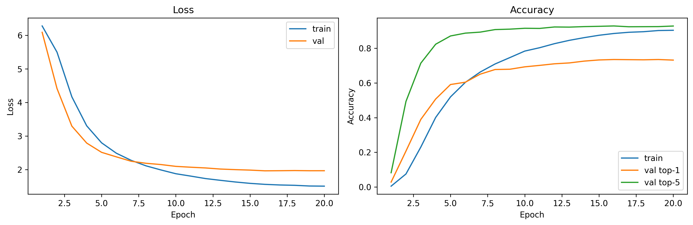
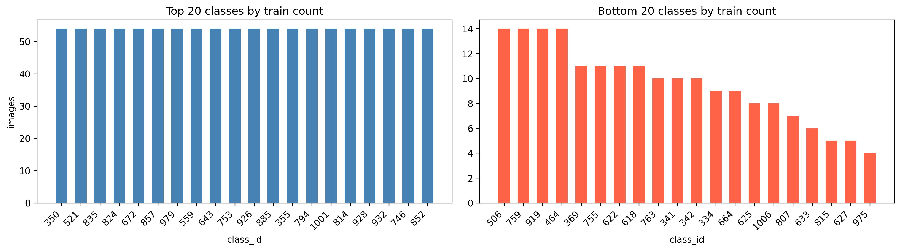

# BirdRecognition

Fine-grained **NABirds** species classification with a fine-tuned **ResNet-50** (PyTorch), plus Grad-CAM interpretability.

Course project: **SCU — Data Analytics with Python**.

<!-- Replace YOUR_KAGGLE_NOTEBOOK_URL with your public notebook link -->
[](YOUR_KAGGLE_NOTEBOOK_URL)

> Training requires a GPU. This repo ships the **notebook logic** plus (after you upload them) **saved metrics, plots, and weights** so others can inspect results without re-running a long training job.

## Dataset & credits

This project uses the **[NABirds](https://dl.allaboutbirds.org/nabirds)** dataset from the **[Cornell Lab of Ornithology](https://www.birds.cornell.edu/home/)**.

NABirds is a collaborative effort among the Cornell Lab of Ornithology, Cornell Tech, Caltech, Brigham Young University, and thousands of contributing photographers and visitors to [All About Birds](https://www.allaboutbirds.org/).

**Acknowledgment (per Cornell Lab terms of use):**

> Data provided by the Cornell Lab of Ornithology, with thanks to photographers and contributors of crowdsourced data at AllAboutBirds.org/Labs. This material is based upon work supported by the National Science Foundation under Grant No. 1010818.

**Paper:** Grant Van Horn et al., *[Building a Bird Recognition App and Large Scale Dataset With Citizen Scientists](https://openaccess.thecvf.com/content_cvpr_2015/papers/Horn_Building_a_Bird_2015_CVPR_paper.pdf)*, CVPR 2015.

Dataset page: https://dl.allaboutbirds.org/nabirds

## Results & performance

Because training needs a GPU, the proof of a successful run lives in committed artifacts under `results/`, `images/`, and `models/` (exported from Kaggle Output).

### Model metrics

<!-- After your Kaggle run, copy numbers from results/final_test_metrics.json -->

| Metric | Value |
|---|---|
| Test top-1 | _TBD — run on Kaggle, then paste from `results/final_test_metrics.json`_ |
| Test top-5 | _TBD_ |
| Best validation top-1 | _TBD_ |
| Test loss | _TBD_ |

Raw metrics file (once uploaded): [`results/final_test_metrics.json`](results/final_test_metrics.json)

### Training curves



### Data snapshots

| Class distribution | Sample training crops |
|---|---|
|  |  |

### Grad-CAM

| Hardest classes | Easiest classes |
|---|---|
|  |  |

### Trained weights

Best validation checkpoint: [`models/best_model.pth`](models/best_model.pth)

Load without retraining:

```python
import torch
from torchvision import models
import torch.nn as nn

num_classes = 555  # NABirds leaf classes used in the notebook
model = models.resnet50(weights=None)
model.fc = nn.Sequential(nn.Dropout(p=0.3), nn.Linear(model.fc.in_features, num_classes))
model.load_state_dict(torch.load("models/best_model.pth", map_location="cpu", weights_only=True))
model.eval()
```

> ResNet-50 weights are ~100MB. If GitHub rejects the upload, use [Git LFS](https://git-lfs.com/) or host the file on Kaggle/Hugging Face and link it here.

## Repository layout

| Path | Purpose |
|---|---|
| [`nabirdsnotebook.ipynb`](nabirdsnotebook.ipynb) | Full training + evaluation + Grad-CAM pipeline |
| [`images/`](images/) | Saved plots for the README |
| [`models/`](models/) | `best_model.pth` |
| [`results/`](results/) | `final_test_metrics.json`, history CSV, per-class CSV |

## How to run on Kaggle

1. Make a **public** Kaggle notebook (GPU recommended) and paste / sync this notebook.
2. Attach NABirds so it mounts at:

   `DATASET_PATH = "/kaggle/input/datasets/shrutidoshi94/nabirds/nabirds"`

   Adjust if your mount path differs.
3. **Run All**. Artifacts are written under `/kaggle/working/images`, `models`, and `results`.
4. In the right-hand **Output** sidebar, download those three folders into this GitHub repo (same names).
5. Fill in the metrics table above from `results/final_test_metrics.json`.
6. Paste your public notebook URL into the Kaggle badge at the top of this README.
7. To force a retrain on Kaggle, delete `models/best_model.pth` and re-run the training cells.

## Evaluation protocol

| Split | Role |
|---|---|
| Train | Model updates (official NABirds train, minus val) |
| Validation | Checkpoint selection + early stopping |
| Test | Final reported accuracy only (never used to pick checkpoints) |

Images are cropped to the provided NABirds bounding boxes before transforms. That matches common NABirds practice but is easier than whole-image classification.

## Key hyperparameters

Defaults from the Configuration cell:

- `NUM_EPOCHS = 20`
- `VAL_FRACTION = 0.1`
- `EARLY_STOPPING_PATIENCE = 5`
- `BATCH_SIZE = 32`
- `LR = 1e-4`
- `IMG_SIZE = 224`
- `SEED = 42`

## Requirements

- Python 3.10+ recommended
- `torch`, `torchvision`, `pandas`, `numpy`, `Pillow`, `matplotlib`, `scikit-learn`
- Jupyter / Kaggle notebook runtime

On Kaggle these packages are typically already available.
